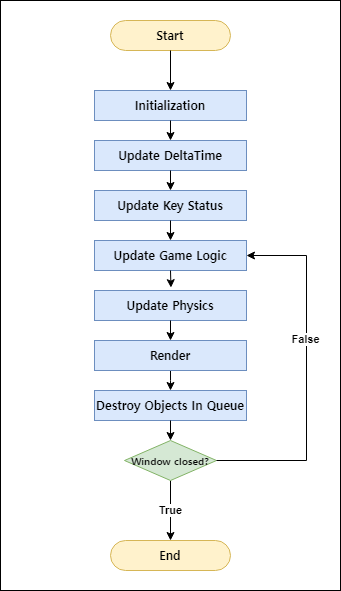

# Web Game Engine


# Introducion

세종대학교 23' 웹프로그래밍 강의의 팀프로젝트 과제를 위해 제작된 웹게임 프레임워크입니다.

# Tutorial

이 엔진에 대한 예제는 [튜토리얼 레포지토리](https://github.com/23-web-teamproject/web-game-engine-tutorial)에 있습니다.

# Index

1. [엔진 파이프라인](#엔진-파이프라인)
2. [씬 객체](#씬-객체)
3. [객체 계층](#객체-계층)

# 엔진 파이프라인

이 엔진은 다음의 파이프라인으로 구성되어 있습니다.



## 1. Initialization

이 단계에서는 엔진에 필요한 초기값들을 초기화합니다.

초기화 작업은 `main.js`에서 `Engine.init()`을 호출함으로 시작됩니다.

`Engine.init()`에서는 게임의 해상도(가로*세로), FPS 그리고 게임이 시작될 때 보여질 씬을 설정합니다.

```js
// main.js
import NewScene from "/src/NewScene/index.js";

Engine.init({
  width: 1920,
  height: 1080,
  fps: 60,
  scene: NewScene,
});
```

위 코드는 1920*1080의 해상도와 60fps로 게임을 실행하도록 설정하고, 첫 씬 객체는 `NewScene`으로 설정하는 코드입니다.

엔진에 필요한 초기값들을 설정함과 동시에, `DeltaTime`을 구하기 위한 `Timer`객체와, 키보드의 키 상태와 마우스의 클릭 상태 등을 확인할 수 있는 `InputManager`도 초기화됩니다.

## 2. Update DeltaTime

이 단계에서는 `Timer`객체가 이전 프레임과 현재 프레임의 시간 차이를 계산합니다.

`DeltaTime`에 대한 자세한 정보는 [이 게시글](https://maxlevel-trace.tistory.com/4)에서 얻을 수 있습니다.

유니티 엔진의 `Timer.deltaTime`과 동일한 개념입니다.

## 3. Update Key Status

이 단계에서는 등록한 이벤트 리스너를 통해 현재 프레임의 키 상태를 얻어오고, 현재 프레임의 키 상태와 이전 프레임의 키 상태를 조합하여 구체적인 키의 상태를 저장합니다.

키보드의 키 상태 뿐만 아니라 마우스의 좌표, 각 버튼의 클릭 상태도 저장합니다.

키보드의 어떤 키가 눌렸는지 알기 위해서는 이벤트 리스너를 등록하여야 합니다. 그러므로 초기화 단계에서 `InputManager`객체를 통해 이벤트 리스너를 등록합니다.

## 4. Update Game Logic

이 단계에서는 게임의 구체적인 로직을 업데이트합니다. 사용자가 설계한 게임 구조를 실행하게 됩니다.

## 5. Update Physics

이 단계에서는 물리적인 상호작용을 업데이트합니다.

사용자가 생성한 객체들중에 물리효과가 켜진 객체들만 수집하여 상호작용을 계산합니다.

이 엔진에서는 **돌림힘을 계산하지 않습니다**. 돌림힘을 구현하기 위한 시간이 부족해서 어쩔 수 없이 계산하지 않기로 했습니다.

## 6. Render

이 단계에서는 씬 내의 모든 객체를 화면에 그립니다.

## 7. Destroy Objects in Queue

이 단계에서는 삭제되기를 기다리는 객체를 삭제합니다.

게임 로직 내에 `object.destroy()`를 실행할 경우 즉시 삭제하지 않고 큐에 객체를 등록하게 됩니다.

게임 로직 업데이트가 종료되고 렌더링까지 마친 후에 삭제됩니다.

삭제된 객체에 접근하면 **`undefined`가 반환되기 때문에**, 게임 로직 내에서 삭제될 가능성이 있는 객체는 **`undefined`상태인지 검사하여야** 오류를 일으키지 않습니다.

# 씬 객체

캐릭터 선택 단계, 전투 단계, 메인, 스테이지 선택 장면 등 게임에는 여러가지 장면이 등장합니다. 이 장면은 `Scene`(씬)이라고 부릅니다.

각 씬은 ***독립적인 의미**를 갖기 때문에 게임은 여러가지 씬으로 나뉩니다.

> 캐릭터 선택, 전투, 스테이지 선택 등을 모두 한 파일(씬)에서 작업한다고 생각한다면 정말 끔찍합니다.

씬에는 여러가지 객체, 사운드파일, 이미지 등이 포함됩니다. 씬 내부에서 이 에셋들을 배치하고 관리합니다.

```js
import { GameObject, Vector } from "/src/engine/module.js";

export default class ExampleScene extends GameObject {
  constructor() {
    this.rect = new Rect({
      transform: {
        position: new Vector(100, 150)
      }
    });
    this.addChild(this.rect);
  }
}
```

위 코드는 사각형 하나를 씬 객체에 추가함과 동시에 사각형의 좌표를 (100, 150)으로 설정하는 씬 객체를 만드는 코드입니다.

이런 식으로 어떤 역할을 맡는 씬을 만들기 위한 코드를 작성할 수 있습니다.

# 객체 계층

이 엔진에서 등장하는 모든 객체는 `GameObject`라는 클래스를 상속받아 구현됩니다.

`GameObject`에는 `parent`와 `child`라는 개념이 추가되어 있습니다.

예를 들어 A라는 객체는 B라는 객체를 자식으로 갖는다고 합니다. 이 말은 A의 속성이 B에게 전달된다는 의미입니다.

A의 좌표를 (100, 100)으로 설정하고 B의 좌표를 (50, 100)이라고 하면 A의 좌표 속성이 B에게 전달되어 B의 최종 좌표는 (150, 200)이 됩니다. 

### 객체 계층에 의해 전달되는 속성
- position(좌표)
- rotation(회전)
- scale(규모)
- alpha color(투명도)

이 개념은 어떤 객체가 다른 객체에 붙어있어야만 할 때 유용하게 사용할 수 있습니다.

예를 들어 지구 주위를 공전하는 달을 만들려고 할 때, 삼각함수를 이용하여 달의 위치를 변경할 수 있지만, 달의 `parent`를 지구로 설정하고 달을 지구로부터 일정 거리만큼 떨어뜨린 후 지구를 회전시키면 공전하는 것처럼 보이게 됩니다.

> 사실 활용할만한 상황이 적지만 이런 개념을 통해 더 쉽게 구현할 수 있다는 것을 소개하고 싶었습니다.
